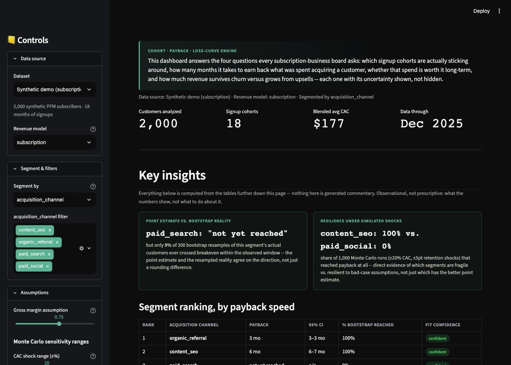

# Cohort / Payback / Loss-Curve Dashboard

**Live app:** https://cohort-payback-loss-curve.streamlit.app/



## Why this exists

I'm finishing my degree in Statistics and Economics at UIUC this spring, and I've been looking at strategic finance and analytics roles at fintech companies. A pattern kept showing up: investors and boards ask Seed and Series A teams for cohort retention, CAC payback, and loss curves, and most of those teams don't actually have anyone building that yet. It's usually a rushed spreadsheet before a board meeting, not something standing and reusable.

So I built it. This is a working dashboard on a synthetic subscription business, framed as a fintech personal finance app since that's close to what a lot of the companies I'm talking to actually build, sitting on top of a calculation engine that isn't hardcoded to the demo data. Give it a real `customers.csv` and `subscription_events.csv` export and it produces the same charts against real numbers, and I've actually run it against two real public datasets (below), not just the synthetic one.

If you're reading this because you're hiring, this repo is meant to answer two things before you even ask: can I actually build the thing, and do I understand the finance well enough to defend every number in it. I tried to make both true, not just claimed, including the parts where the first version of something was wrong and I had to find out why.

## What it actually does

- **Cohort retention** – what percent of each signup cohort is still paying N months later, plus a Kaplan-Meier survival curve with a bootstrapped confidence band for datasets where signup cohorts can't be trusted at face value
- **CAC payback** – how many months it takes each segment to earn back what it cost to get a customer, with a bootstrapped confidence interval and a "% of resamples that ever crossed breakeven" reality check next to the point estimate
- **LTV:CAC** – whether a segment's customers are worth more than what it costs to acquire them, from a parametric survival model fit to that segment's actual customer data, bounded to a defensible horizon instead of extrapolated to infinity
- **GRR and NRR** – how much of a cohort's revenue sticks around over time, with and without counting upsells
- **Monte Carlo sensitivity** – simulates the payback-month distribution under random CAC and retention shocks, so you can see which segments are fragile versus resilient, not just which has the better point estimate
- **Key Insights panel** – segment ranking, confidence-aware comparisons, and a driver decomposition explaining *why* one segment beats another (CAC or retention/margin), computed from the tables on the page, not generated text

All of it is unit tested against hand-calculated examples or, where a formula can't be solved by hand, against synthetic data generated from known parameters so I can check the fitted numbers come back out. Not just eyeballed against a chart until it looked right.

## Repo structure

```
data_gen/
  generate.py       synthetic dataset generator (channel-differentiated demo data)
  real_data.py       reshapes two real public datasets into the same schema (see below)
engine/
  loaders.py          data ingestion + validation, the schema boundary. Swap real data in here.
  metrics.py           cohort retention, CAC payback, LTV:CAC, GRR/NRR, Monte Carlo, driver decomposition
  survival.py          Kaplan-Meier, parametric survival fits, bootstrap confidence intervals
tests/                 one file per engine module, every metric checked against a hand-calculated
                         or known-parameter fixture, including the bugs described below
data/
  customers.csv, subscription_events.csv     synthetic demo data
  real/telco/, real/retail/                   reshaped real data (see "Real data" below)
app.py                Streamlit UI, renders only. Every number on screen comes from engine/
```

## Running it locally

```bash
python3 -m venv venv && source venv/bin/activate
pip install -r requirements.txt

python3 -m data_gen.generate      # writes data/customers.csv, data/subscription_events.csv
pytest tests/                     # check the engine against hand-calculated / known-parameter examples
streamlit run app.py
```

## The input schema

This is the part that makes it reusable instead of a one-off script.

**customers.csv**

| column | type | notes |
|---|---|---|
| `customer_id` | str | unique |
| `signup_date` | date | any day-of-month works, it gets floored to month start |
| `acquisition_channel` | str | e.g. `paid_social`, `organic_referral` |
| `initial_plan` | str | informational only, not required by the math |
| `cac` | float | fully-loaded cost to acquire this customer |

Any other column can ride along too (Telco's Contract type, Retail's Country) and becomes available as a segmentation dimension automatically, without touching the engine.

**subscription_events.csv**

| column | type | notes |
|---|---|---|
| `customer_id` | str | foreign key into `customers.customer_id` |
| `month` | date | calendar month of the billing event |
| `mrr` | float | that customer's revenue that month, `0` if churned. Can be negative for a blended/episodic business in a refund-heavy month. |

To point the dashboard at real data, pick "Upload your own" in the sidebar and upload two CSVs in this shape. Everything downstream recomputes on its own. No code changes needed if the schema matches. If a real export uses different column names, `engine/loaders.py` is the only file that has to change.

## How I calculated everything

This is the part I'd want to read before someone asks me "how did you get this number" in an interview.

### Revenue model: subscription vs. blended

Not every business's "active" customer looks the same. A subscription business churns the month MRR hits `$0`, full stop. A retailer or marketplace doesn't: a customer with no purchase this month might just not have bought anything *yet* this month, and treating every quiet month as churn makes a perfectly healthy repeat-purchase business look like it collapses to near-zero retention by month two (I know, because that's exactly what an early version of this did to real UCI retail data, see the bugs section below).

So `revenue_model` is an explicit setting: `subscription` keeps the strict "MRR = 0 this month means gone" rule, and `blended` instead asks whether a customer transacted within a trailing reactivation window (default 3 months, adjustable). Inside that window a customer is "dormant," not churned; only silence that outlasts the window flips them to actually churned. The window length is a stated business assumption in a named constant, not something fit from the data.

### Segmentation

`segment_col` generalizes what used to be a hardcoded "acquisition_channel" everywhere in the engine. Any customer-level column works: Telco segments by Contract type because it has no real channel, Retail segments by the assumed channel because it has no real alternative. The dashboard's sidebar picks up whatever categorical columns exist in the loaded data automatically.

### Cohort retention

Percent of a signup cohort with MRR greater than 0 (or, in blended mode, within the reactivation window) at month N since signup, computed as a dense customer by calendar-month grid running from each customer's signup month through the dataset's last observed month. Cells for a cohort and tenure combination that hasn't happened yet are left blank, not zero, which is why the heatmap renders as a triangle instead of a full rectangle.

**This view has a known failure mode worth naming directly**: if a dataset's signup dates are *reconstructed* rather than real (see Telco below, where all we have is "tenure at snapshot"), bucketing customers into monthly cohorts by that reconstructed date creates survivorship bias — a cohort that appears "old" can only exist because its members already lived that long. The fix isn't a smarter bucketing scheme, it's not bucketing at all for that case: see Kaplan-Meier below.

### Kaplan-Meier survival curve

For any dataset, `engine/survival.py` extracts one `(duration, was the churn actually observed or is this customer still active/censored)` pair per customer, and runs the standard Kaplan-Meier estimator directly on that, with no cohort bucketing at all. This is the honest way to build a pooled retention curve when signup dates can't be trusted, and it's also just a useful cross-check when they can. The dashboard shows it with a shaded 95% bootstrap confidence band (resample customers with replacement, recompute the curve, repeat 300 times, take percentiles at each month).

### CAC payback, in months, per segment

`payback_month` is the first month where average cumulative gross margin per customer, divided by average CAC, crosses 1.0. Computed separately per segment, never blended.

Two things matter for correctness:

1. **Gross margin, not revenue.** Payback should measure cash actually recovered. Default assumption is 75% gross margin, adjustable in the sidebar.
2. **Right-censoring.** A customer who signed up last month can't have 12 months of margin yet. The engine only averages customers who've actually been observed that long, and only reports a given month once at least 20% of the segment has reached it.

If the ratio never crosses 1.0 inside the reliably covered window, payback shows up as "not yet reached" instead of a guess. The dashboard also shows a bootstrapped 95% confidence interval on the payback month itself, and the percentage of bootstrap resamples that ever reached payback at all — which can be a more informative number than the point estimate. In the demo data, `paid_search` shows "not yet reached," and only about 9% of its bootstrap resamples ever cross breakeven within the observed window. That's not the same statement as `paid_social`'s 0%, and the dashboard says so explicitly rather than collapsing both into the same "not yet reached" label.

### LTV : CAC

`LTV(segment) = expected_active_months × ARPA(segment) × gross_margin`, where `expected_active_months` comes from a parametric survival model, shifted-beta-geometric or Weibull hazard, whichever fits a segment's actual `(duration, censored?)` data better by log-likelihood, fit by maximum likelihood rather than eyeballed off a curve.

That model is only trusted **through a capped horizon**: 3x whatever tenure the segment has actually been observed for, never more than 240 months. Two independent confidence signals travel with every number:

- **Fit confidence** – is there enough data (customers, non-censored) to trust the fitted curve at all.
- **Extrapolation confidence** – has the curve converged by the capped horizon, or is a meaningful share of the survival probability still "alive" when the cap hits, meaning the bounded number likely understates true lifetime value.

A segment can be fit-confident and still extrapolation-low-confidence at the same time. That's not a contradiction, it's the honest version of "trust this number through month X, and I'm not claiming further than that" (see the bugs section for why this split exists).

### GRR and NRR, the loss curves

```
NRR(t) = sum(MRR at t) / sum(MRR at 0)                     -- can go above 100%
GRR(t) = sum(min(MRR at t, MRR at 0)) / sum(MRR at 0)       -- capped at 100%, by construction
```

The `min()` clips any customer's upsell back down to what they started at before summing, so expansion can never end up in GRR's numerator, while a downgrade or churn still pulls it down.

### Monte Carlo payback sensitivity

Given a CAC shock range (±%) and a retention shift range (±percentage points), each simulated run draws one random value from each range and asks: under this scenario, does the segment still reach payback, and when? 1,000 runs by default. The same draws are reused across every segment in a given run, so "how much does paid_social's payback move under a +15% CAC shock" and "how much does organic's" are answers to the literal same simulated scenario, not two independently randomized processes that happen to be shown side by side.

CAC is shocked multiplicatively. The retention shift is applied as an **additive dollar adjustment** to cumulative margin (`shift_pts/100 × elapsed_months × ARPA × gross_margin`), not a ratio, for a specific reason described in the bugs section: a ratio-based version of this divides by zero at any tenure month where observed retention is exactly 0%, which is a real state a real cohort can be in.

The output is a distribution, not a point: percent of runs that ever reached payback, median, and the P10-P90 range among the runs that did. `fit_confidence` carries forward from the survival model, so a segment too thin to trust at the point-estimate level doesn't get to look more precise just because the output here is a histogram.

### Driver decomposition (Key Insights panel)

When one segment's payback ratio beats another's, the dashboard doesn't just say "it's better," it breaks down why, using an exact bridge decomposition (the same technique as an FP&A price/volume bridge): swap segment B's CAC for segment A's CAC while keeping B's margin, see how much of the gap that swap alone closes, and attribute the rest to margin/retention.

```
ratio_a            = margin_a(t) / cac_a
ratio_b_with_a_cac = margin_b(t) / cac_a
cac_effect          = ratio_b_with_a_cac - ratio_b_actual
margin_effect        = ratio_a - ratio_b_with_a_cac
```

`cac_effect + margin_effect` equals the total gap exactly, by construction, not approximately. Every insight in the panel is observational, not prescriptive: "X pays back faster, outside the margin of error" or "not a statistically meaningful difference," never "you should move budget to X."

## The synthetic data

`data_gen/generate.py` builds about 2,000 customers across 18 monthly signup cohorts and 4 acquisition channels, each with different economics on purpose:

| Channel | CAC | What happens to it |
|---|---|---|
| `organic_referral` | low, ~$65 | mediocre long-run retention |
| `content_seo` | medium, ~$150 | best long-run retention, the "spend more here" channel |
| `paid_search` | medium-high, ~$200 | mediocre, payback not yet observed |
| `paid_social` | high, ~$300 | okay early retention, then a steep drop-off |

Churn follows a hazard curve that starts high and decays toward a per-channel floor (the classic steep-then-flat retention shape), later cohorts churn a bit less than earlier ones on purpose, and customers occasionally move a plan tier up or down, which is what makes NRR differ from GRR. Reproducible with a fixed seed (`SEED = 42`).

## Real data

Two real public datasets, reshaped by `data_gen/real_data.py` into the same schema, specifically because synthetic data is too well-behaved to stress-test a survival model or a Monte Carlo simulation:

- **IBM Telco Customer Churn** (7,043 real customers, real tenure and churn outcome) — the subscription-mode validation case, and specifically the case for Kaplan-Meier over cohort bucketing, since its signup dates are reconstructed from tenure rather than real.
- **UCI Online Retail II** (1M+ real transactions, ~5,900 customers) — the blended/episodic-revenue validation case, since its repeat-purchase pattern is exactly the kind of irregular behavior that breaks a subscription-shaped "active" definition.

Neither dataset has acquisition channel or CAC, since they're real businesses and that data isn't public. Both get 4 synthetic channels with assumed CAC layered on for stress-testing purposes, and every place that shows up (the app, the diagnostics, this file) labels it assumed, never presented next to the real churn/revenue numbers as if it were real.

## Bugs I found and fixed, and how I found them

I'm including this because it's a more honest answer to "how do you know your numbers are right" than just asserting they are. Every one of these was caught by validating against either a hand-calculated example, a real dataset's known ground truth (like Telco's actual churn rate), or synthetic data generated from parameters I already knew the answer to, before trusting a new capability on messy data. None of them were caught by the result "looking wrong" on inspection, they were caught by a test built specifically to catch that class of mistake.

1. **A misclassified 73% of Telco's customers as churned.** Reconstructing signup dates from tenure meant every customer's data grid ended exactly at their own tenure, including customers who are actually still active. The last "month" in their grid had no billing row, and a missing row defaults to churned, so ~5,000 real still-active customers looked churned. Caught by cross-checking Kaplan-Meier's censoring rate (0.16%) against Telco's real `Churn` column (73.5% "No"), a sanity check I ran specifically because the two numbers should have matched and didn't.
2. **A swapped-parameter formula bug in the survival model fit.** The closed-form shifted-beta-geometric survival function had alpha and beta transposed. The model still numerically converged and produced plausible-looking retention curves, it just converged to the wrong answer. Caught by generating synthetic data from a *known* alpha/beta and checking the fitted parameters came back close to the truth, which they didn't until I fixed the formula, verified independently against numerical integration of the underlying expectation.
3. **A silently-wrong "which model won" comparison.** A dict copy broke Python object identity right before an `is` check, so the code that reports whether shifted-beta-geometric or Weibull fit better always reported the same answer regardless of which one actually had the higher likelihood. Caught by a test with two models fit to the same data and an explicit assertion on which one the comparison logic should have picked.
4. **An LTV model that projected 22% of customers still retained after 20 years**, having only observed 23 months of real data for that segment. The parametric fit was correct on the data it saw, it was just being asked to extrapolate 10x past it. Fixed by capping the extrapolation horizon at 3x a segment's own observed tenure and adding a second, separate confidence flag specifically for "there's real survival probability left uncounted at this cutoff."
5. **A division-by-zero that turned every Monte Carlo simulation into a false "reached payback."** The first version of the retention-shift mechanism divided by a segment's observed retention percentage, which is exactly 0% at some real tenure months (an early micro-cohort that's fully churned by then). Caught because a zero-shock simulation run didn't reproduce the exact point estimate from the non-simulated payback calculation, which it has to, by construction, since a zero shock is just the real data replayed. Fixed with an additive dollar-based adjustment instead of a ratio, which can't divide by anything.
6. **Inconsistent series colors across charts.** A channel's color depended on whatever order that specific chart happened to sort its rows in, so the same channel could render a different color on the payback chart versus the LTV chart. Fixed with one color assignment computed once per segment value and reused everywhere.

## Where this is still a demo

- **75% gross margin is a placeholder,** not a researched number for any real company.
- **No win-back modeling** in the synthetic generator. Once a synthetic customer churns, they stay churned.
- **CAC is taken as a given per customer,** not derived from marketing spend divided by customers acquired.
- **The 20% coverage threshold and the 3x extrapolation cap are judgment calls**, named constants in `engine/metrics.py` and `engine/survival.py` if a specific use case wants a different bar.
- **The Monte Carlo retention-shift mechanism is a first-order approximation** (a linear dollar adjustment), appropriate for a sensitivity tool that answers "how sensitive is this," not a re-fit causal model.

## If you want to talk about it

This was built end to end by me: generator, tested engine, dashboard, deployment, and the real-data validation and bug-fixing described above. Happy to walk through any of it or point it at a real dataset. [linkedin.com/in/aadit-tibrewala](https://linkedin.com/in/aadit-tibrewala)
